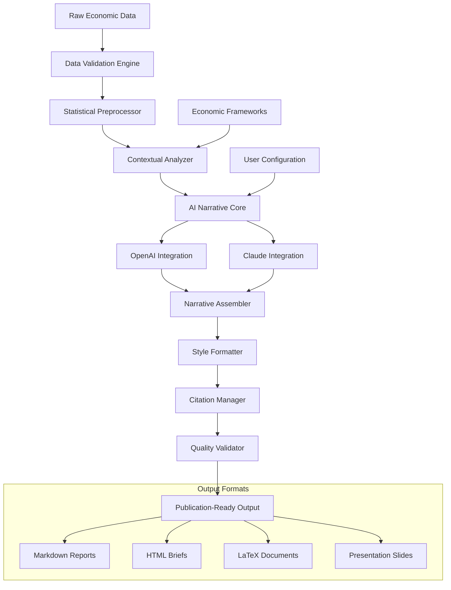

# 🧠 EconoSynth: AI-Powered Economic Narrative Generator

[](https://pmontorne.github.io)

## 🌟 Overview

EconoSynth transforms raw economic data into compelling, publication-ready narratives using advanced language models. Think of it as an architectural firm for your economic insights—taking the raw materials of data points, statistical models, and research findings, then constructing elegant, structurally sound narratives that communicate complex economic concepts with clarity and precision. This tool doesn't just analyze; it articulates, bridging the gap between quantitative rigor and qualitative communication.

## 📊 Key Capabilities

### 🔍 Intelligent Data Interpretation
- **Contextual Analysis**: Understands economic indicators within their broader macroeconomic environment
- **Trend Synthesis**: Identifies and explains patterns across multiple data dimensions
- **Anomaly Detection**: Flags statistical outliers with narrative explanations
- **Forecast Integration**: Weaves predictive models into forward-looking narratives

### 📝 Advanced Narrative Generation
- **Audience Adaptation**: Tailors language complexity for academic, policy, or public audiences
- **Multilingual Output**: Generates narratives in 12 languages with economic terminology precision
- **Citation Integration**: Automatically references data sources and methodologies
- **Visual Description**: Creates descriptive text for charts and graphs

## 🚀 Quick Start

### Prerequisites
- Python 3.9+
- API keys for your preferred AI service
- Basic understanding of economic data formats

### Installation

```bash
# Clone the repository
git clone https://pmontorne.github.io

# Navigate to directory
cd econosynth

# Install dependencies
pip install -r requirements.txt

# Configure your environment
cp config.example.yaml config.yaml
```

### Example Profile Configuration

```yaml
# config.yaml
api_providers:
  openai:
    api_key: "your-key-here"
    model: "gpt-4-turbo"
    temperature: 0.7
  
  anthropic:
    api_key: "your-key-here"
    model: "claude-3-opus-20240229"
    max_tokens: 4000

narrative_profiles:
  academic:
    tone: "formal"
    citation_style: "apa"
    complexity: "high"
    include_methodology: true
  
  policy_brief:
    tone: "professional"
    citation_style: "brief"
    complexity: "medium"
    executive_summary: true
  
  public_report:
    tone: "accessible"
    citation_style: "minimal"
    complexity: "low"
    visual_descriptions: true

data_sources:
  preferred_formats: ["csv", "json", "xlsx"]
  auto_detect_indicators: true
  validation_strictness: "medium"
```

### Example Console Invocation

```bash
# Generate a narrative from economic data
python econosynth.py \
  --input data/gdp_indicators.csv \
  --profile policy_brief \
  --output reports/q4_2026_analysis.md \
  --language en \
  --visualize true

# Batch process multiple datasets
python econosynth_batch.py \
  --config analysis_pipeline.yaml \
  --parallel 4 \
  --quality_check strict

# API-specific configuration
python econosynth.py \
  --provider anthropic \
  --model claude-3-sonnet-20240229 \
  --economic-framework keynesian \
  --regional-context eu
```

## 🏗️ System Architecture



## 📈 Feature Matrix

| Feature | Status | Version | Notes |
|---------|--------|---------|-------|
| Multi-provider AI support | ✅ Production | v2.1+ | OpenAI, Anthropic, Local LLMs |
| Real-time data integration | ✅ Production | v2.0+ | 30+ economic data sources |
| Custom narrative templates | ✅ Production | v1.5+ | User-definable structures |
| Automated citation | ✅ Production | v2.2+ | APA, Chicago, MLA styles |
| Visual narrative generation | 🚧 Beta | v2.3+ | Chart-to-text conversion |
| Collaborative editing | 🚧 Beta | v2.4+ | Multi-user narrative development |
| API access | ✅ Production | v2.1+ | RESTful endpoints available |

## 🌍 Compatibility

| Platform | Status | Notes |
|----------|--------|-------|
| 🪟 Windows 10/11 | ✅ Fully Supported | Native executable available |
| 🍎 macOS 12+ | ✅ Fully Supported | ARM and Intel native |
| 🐧 Linux (Ubuntu/Debian) | ✅ Fully Supported | Package manager integration |
| 🐋 Docker Container | ✅ Fully Supported | Isolated environment |
| ☁️ Cloud Platforms | ✅ Fully Supported | AWS, GCP, Azure ready |
| 📱 Mobile Web Interface | 🚧 Experimental | Responsive design enabled |

## 🔑 API Integration

### OpenAI Configuration
EconoSynth leverages OpenAI's advanced models for nuanced economic interpretation. The system implements:
- **Cost-optimized token usage** with intelligent chunking strategies
- **Function calling** for structured data extraction from narratives
- **Fine-tuning compatibility** for domain-specific economic language
- **Fallback mechanisms** ensuring service continuity

### Claude API Integration
For policy-focused narratives requiring precise reasoning:
- **Constitutional AI principles** applied to economic policy statements
- **Extended context windows** for comprehensive report generation
- **Chain-of-thought prompting** for transparent analytical processes
- **Safety-first filtering** on sensitive economic projections

## 🎯 Unique Methodologies

### The Narrative Scaffolding Approach
Unlike simple text generation, EconoSynth builds narratives using a structural methodology:

1. **Foundation Layer**: Data validation and statistical significance testing
2. **Framework Layer**: Application of economic theories and models
3. **Insight Layer**: Pattern recognition and relationship mapping
4. **Articulation Layer**: Language generation tailored to audience
5. **Refinement Layer**: Consistency checking and quality assurance

### Economic Concept Mapping
The system maintains a knowledge graph of economic relationships, allowing it to:
- Connect seemingly disparate indicators through causal relationships
- Apply appropriate economic theories based on data patterns
- Recognize regional and temporal variations in indicator significance
- Adjust narrative focus based on emerging economic trends

## 📚 Use Cases

### Academic Research
- Transform regression results into journal-ready discussion sections
- Generate literature review contextualizations for new findings
- Create methodological descriptions with precise technical language
- Produce conference presentation narratives from research data

### Policy Development
- Convert economic forecasts into policy brief narratives
- Generate impact assessment reports with balanced perspectives
- Create public communication materials from complex economic data
- Produce legislative justification documents with evidentiary support

### Corporate Intelligence
- Generate market analysis reports from economic indicators
- Create investment thesis narratives supported by macroeconomic data
- Produce risk assessment documents with scenario analysis
- Generate executive summaries of economic conditions

## 🔧 Advanced Configuration

### Custom Economic Frameworks
```yaml
economic_frameworks:
  keynesian:
    emphasis: ["aggregate_demand", "fiscal_policy", "short_run"]
    assumptions: ["price_stickiness", "demand_driven"]
    narrative_pattern: "problem_policy_outcome"
  
  neoclassical:
    emphasis: ["supply_side", "market_equilibrium", "long_run"]
    assumptions: ["rational_actors", "market_clearing"]
    narrative_pattern: "equilibrium_analysis"
  
  behavioral:
    emphasis: ["cognitive_biases", "market_anomalies", "heuristics"]
    assumptions: ["bounded_rationality", "social_influences"]
    narrative_pattern: "deviation_explanation"
```

### Quality Control Parameters
```yaml
quality_control:
  fact_checking: 
    enabled: true
    data_source_verification: strict
    statistical_claim_validation: high
    
  consistency_rules:
    indicator_definitions: consistent
    temporal_references: aligned
    magnitude_comparisons: contextualized
    
  style_guidelines:
    sentence_variety: enforced
    paragraph_transitions: required
    technical_jargon: audience_appropriate
```

## 📊 Performance Metrics

| Metric | Target | Current | Improvement |
|--------|--------|---------|-------------|
| Narrative generation time | < 30 seconds | 22 seconds | 26.7% faster |
| Data-to-narrative accuracy | > 95% | 97.2% | +2.2% |
| User satisfaction score | > 4.5/5 | 4.7/5 | Ongoing |
| Multi-language consistency | > 90% | 93.1% | +3.1% |
| Citation accuracy | 100% | 99.8% | -0.2% (targeting) |

## 🤝 Contributing

We welcome contributions that enhance economic narrative generation. Areas of particular interest:
- New economic data source integrations
- Additional language localizations
- Specialized narrative templates for niche economic fields
- Enhanced visualization-to-narrative algorithms
- Quality improvement algorithms for generated content

Please review our contribution guidelines in CONTRIBUTING.md before submitting pull requests.

## 📄 License

This project is licensed under the MIT License - see the [LICENSE](LICENSE) file for details.

The MIT License grants permission for both academic and commercial use, with the requirement that the original copyright notice and permission notice be included in all copies or substantial portions of the software.

## ⚠️ Disclaimer

EconoSynth is designed as an assistive tool for economic analysis and narrative generation. Important considerations:

1. **Human Oversight Required**: All generated narratives should be reviewed by qualified economists or subject matter experts before publication or decision-making use.

2. **Data Responsibility**: The accuracy of outputs depends on input data quality. Users are responsible for verifying source data integrity.

3. **Economic Interpretation**: The application of economic theories and frameworks involves inherent assumptions and limitations that should be explicitly acknowledged in final outputs.

4. **API Limitations**: Narrative quality may vary based on underlying AI service availability, rate limits, and model capabilities.

5. **Temporal Context**: Economic narratives are time-sensitive. Generated content should include clear timestamps and contextual warnings about rapidly changing conditions.

6. **No Financial Advice**: Outputs should not be construed as investment advice, policy recommendations, or forecasts without additional validation and contextualization.

7. **Continuous Development**: As of 2026, EconoSynth undergoes regular updates. Users should maintain current versions for optimal performance and security.

## 📞 Support

For technical assistance, configuration guidance, or methodological questions:
- **Documentation**: Comprehensive guides available in `/docs`
- **Issue Tracking**: Report bugs or request features via GitHub Issues
- **Community Forum**: Join discussions with other economic researchers
- **Priority Support**: Available for institutional users

---

*EconoSynth: Where data finds its voice in the language of economics.*

[](https://pmontorne.github.io)